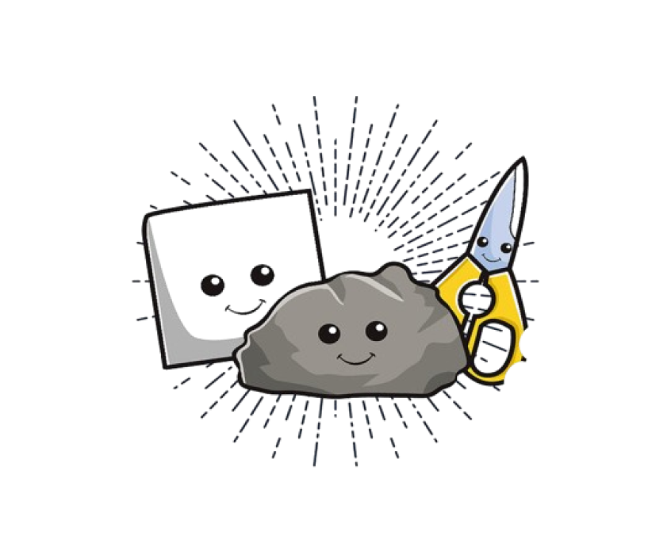

# Rock Paper Scissors Game



## Introduction

Welcome to the Rock Paper Scissors game! This is a classic hand game played between two people, in this case, you and the computer. The game is simple yet highly entertaining, and it tests your intuition and strategy skills.

## How to Play

1. **Start the Game**: Run the provided Python script (`main.py`) to start the game.
2. **Input Your Choice**: You will be prompted to enter your choice - either R:rock, P:paper, or S:scissors.
3. **Computer's Turn**: The computer will randomly select its choice.
4. **Checking Result**: The game will compare your choice with the computer's choice and declare the winner based on the traditional rules:
   - Rock beats scissors
   - Scissors beats paper
   - Paper beats rock
   - If both players choose the same, it's a tie!
5. **Play Again**: After each round, you will have the option to play again or exit the game.

## Features

- Simple and easy-to-understand gameplay.
- Easy to play with keyboard and CLI based gameing experience.
- No need mouse  for playing game.
- Quick and addictive gameplay suitable for all ages.
- Option to play multiple rounds for continuous entertainment.

## Requirements

- Python 3.x

## Installation

1. Clone this repository to your local machine using Git.
   
```bash
git clone https://github.com/imparth7/rockpaperscissor.git
```

2. Navigate to the directory containing the game files.

```bash
cd rockpaperscissor
```

3. Run the Python script to start the game.

```bash
python main.py
```

## Contributing

Contributions are welcome! If you have any suggestions, improvements, or feature requests, feel free to open an issue or submit a pull request.